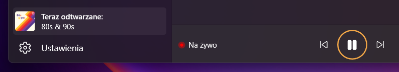
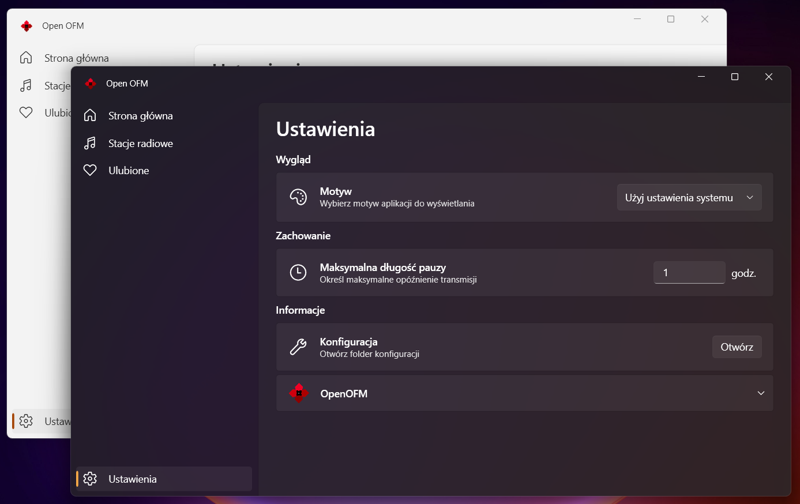

# Open OFM

Open OFM is a desktop player for the Polish internet radio service OpenFM. It features a basic favorites and recommendation system, the ability to pause and resume playback, and a modern design.


## Installation

Open OFM is a standalone Windows executable file and doesn't require installation. However, it requires the following third-party software to work:

### FFmpeg

The easiest way to install FFmpeg on Windows is to use Winget:

```
winget install -e --id BtbN.FFmpeg.LGPL
```

### OpenAL

> [!TIP]
> OpenAL is quite common, and you may already have it installed.

The easiest way to install OpenAL on Windows is to use Winget:

```
winget install -e --id OpenAL.OpenAL
```

## Features

### Manage your favorites

With Open OFM, you can manage your favorite songs and receive recommended radio stations based on your preferences.


### Pause and resume

Don't miss your favorite songs! With Open OFM, you can pause and resume playback at any moment.



### Modern design

Open OFM looks like a native Windows app and supports both light and dark themes.


