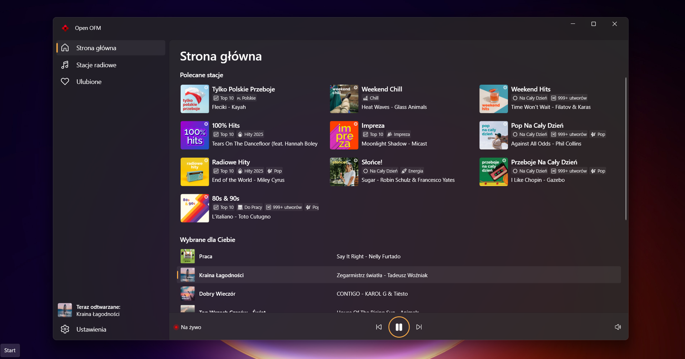
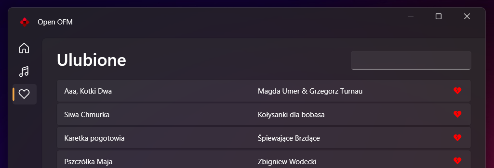

# Open OFM

Open OFM is a desktop player for the Polish internet radio service OpenFM. It features a basic favorites and recommendation system, the ability to pause and resume playback, and a modern design.

## Features

### Manage your favorites

With Open OFM, you can manage your favorite songs and receive recommended radio stations based on your preferences.

### Pause and resume

Don't miss your favorite songs! With Open OFM, you can pause and resume playback at any moment.

